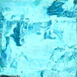

# RandomArt training code

Training and inference code for my first real Model, following the [HF diffusion model course](https://huggingface.co/learn/diffusion-course/unit1/2#step-2-download-a-training-dataset).  
It's an unconditional 128×128 DDPM that generates
painterly abstract images. The resulting diffusion model is published in the [HF repository](https://huggingface.co/DD-65/randomart).

## Examples

| | | |
|---|---|---|
|  |  | 


## Inference

Run inference (assuming PyTorch and Diffusers are installed and the HF repo is downloaded to the same parent directory) from this directory with:

```bash
python inference.py
```

Which will generate 3 images at 500 steps each. For faster exploration, use 100 inference steps. Around 250 steps provides a useful speed/quality balance, while 500 steps gives more time to final renders.

## Training
The Model was trained on a 36 GB M3 Max Mac in approx. 5 hours. The dataset is a ~7600 Row subset of [Wikiart](https://huggingface.co/datasets/huggan/wikiart) filtered for images under 2400px.

The images are resized to 128x128 and preprocessed, training then takes place over 20 epochs with a batch size of 8. The training script is `train.py` and can be run with:

```bash
python train.py
```
which assumes the above parameters. Before training the images have to be downloaded and preprocessed with:

```bash
python load_dataset.py
```
which as mentioned above streams the dataset to filter for images under 2400px and resizes them to 128x128. The resulting dataset is saved in `./wikiart_under_2400_resized_dataset`. The loading process can be interrupted at any time if the desired amount of images has been downloaded.
